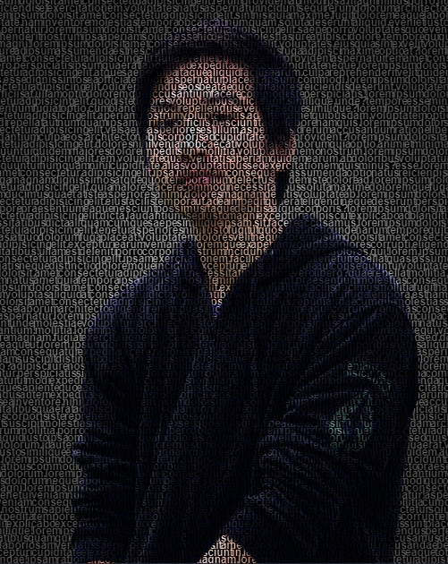

# Text Portrait

Create stunning text portrait effects using only HTML and CSS. This project overlays text onto a portrait image, allowing the image to show through the text for a unique visual effect.

## Preview



## How It Works

- The `body` uses a black background and the "Poppins" font.
- The `#text` element:
  - Aligns and spaces text for a portrait effect.
  - Uses a background image (your portrait) clipped to the text.
  - Makes the text itself transparent so the image shows through.
  - Adjusts size, padding, and spacing for optimal appearance.
- Responsive design: A media query adapts the effect for mobile screens.

## Getting Started

1. **Add your portrait image**  
   Place your desired image in the `assets` folder (e.g., `assets/portrait.jpg`).

2. **Update the CSS**  
   In your CSS, set the background image path for the `#text` selector:

   ```css
   #text {
     background-image: url('assets/portrait.jpg');
     /* ...other styles... */
   }
   ```

3. **Add the HTML**  
   Include an element with the `id="text"` in your HTML:

   ```html
   <div id="text">
     Your text goes here...
   </div>
   ```

4. **Open your HTML file in a browser**  
   You should see your text portrait effect!

## Customization

- Change the text, font, or image for different effects.
- Adjust CSS properties (font size, spacing, background size) to fine-tune the look.

## License

This project is open source and free to use.
