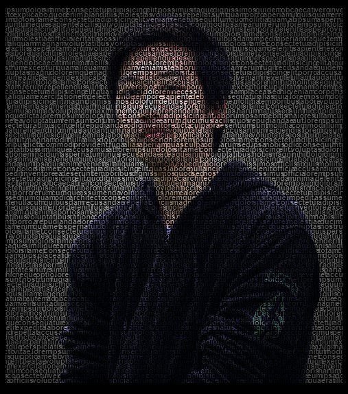

# Project Description: Text Portrait

This project utilizes CSS and HTML to create a text portrait effect. The text content is transformed into a portrait image by setting the background to a portrait image and adjusting various CSS properties.

## The result



## Code Explanation

The ```body``` selector sets the background color to black and hides overflowing content. It also specifies the font family as "Poppins".

The ```text``` id selector styles the text content. It aligns the text vertically, sets the line height to 8 pixels, transforms the text to lowercase, and sets the font size to 12 pixels with a bolder weight. The background is set to a portrait image located in the "assets" folder. The text is aligned centrally within the background image, and the image is fixed in place without repeating. The ```-webkit-text-fill-color``` property is set to transparent to make the text invisible, while the ```-webkit-background-clip``` property is set to text to allow the background image to show through the text. The background size is set to 80vh (viewport height) to adjust the size of the portrait, and the background position is centered. The padding is set to 28% on both the left and right sides, and the letter and word spacing are adjusted to fine-tune the appearance.

The ```@media``` query targets smaller screen sizes to adjust the styling for mobile devices. It removes the padding and adjusts the font size, line height, letter spacing, and word spacing to fit the smaller screen size.

## Sample Usage

To use this code, you need to have an HTML file that includes the CSS code. Make sure to place your desired portrait image in the "assets" folder and update the path in the CSS code accordingly. Then, add an element with the id "text" to your HTML file, and the text portrait effect will be applied to that element.
